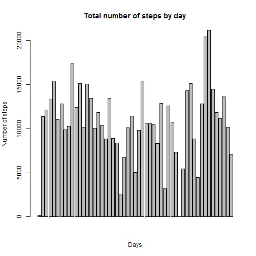
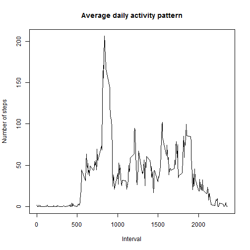
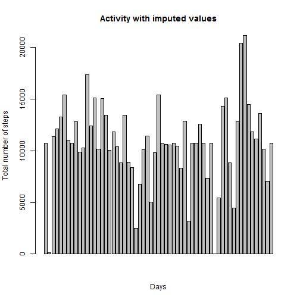
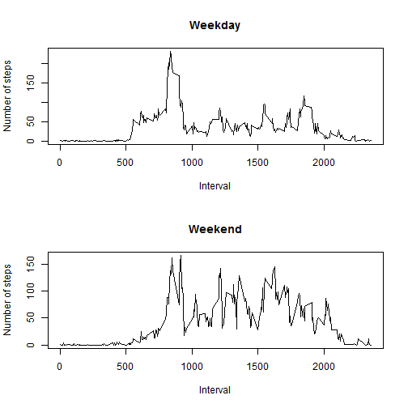

## Loading and preprocessing the data


```r
# change locale to English

invisible(Sys.setlocale("LC_TIME", "English"))

# load data

activity <- read.csv("activity.csv")

# remove n/a data

activity_avail <- activity[!is.na(activity$steps),]
```

## What is mean total number of steps taken per day?


```r
# aggregate data by days

activity_days <- aggregate(activity_avail$steps,  list(date = activity_avail$date), sum)

# plot histogram

barplot(activity_days$x, main = "Total number of steps by day", xlab = "Days", ylab = "Number of steps")
```

 

```r
# calculate mean

mean(activity_days$x)
```

```
## [1] 10766.19
```

```r
# calculate median

median(activity_days$x)
```

```
## [1] 10765
```

## What is the average daily activity pattern?


```r
# aggregate data by intervals

activity_intervals <- aggregate(activity_avail$steps,  list(interval = activity_avail$interval), mean)

# plot data

plot(activity_intervals$interval, activity_intervals$x, type = "l", 
    main = "Average daily activity pattern", xlab = "Interval", ylab = "Number of steps")
```

 

```r
# get interval with maximum average steps 

activity_intervals$interval[which.max(activity_intervals$x)]
```

```
## [1] 835
```

```r
# get sum of na values

sum(is.na(activity$steps))    
```

```
## [1] 2304
```


## Imputing missing values

Strategy: imputing average for interval when values are missed.


```r
# calculate indexes, then impute na

indexes <- apply(activity, 1, function(x) which(as.numeric(activity_intervals$interval) == as.numeric(x[3])))
activity_impute <- activity
activity_impute$steps[is.na(activity_impute$steps)] <- 
    activity_intervals$x[indexes[is.na(activity_impute$steps)]]

# aggregate and plot data with imputed values

activity_days_impute <- aggregate(activity_impute$steps,  list(date = activity_impute$date), sum)
barplot(activity_days_impute$x, main = "Activity with imputed values", xlab = "Days", 
    ylab = "Total number of steps")
```

 

```r
# calculate mean

mean(activity_days_impute$x)
```

```
## [1] 10766.19
```

```r
# calculate median

median(activity_days_impute$x)
```

```
## [1] 10766.19
```

We get the same mean and slightly higher median.

## Are there differences in activity patterns between weekdays and weekends?


```r
# two graphs on plot

par(mfrow = c(2, 1))

# make weekday/weekend factor

activity_impute$weekend <- factor((weekdays(as.Date(activity_impute$date)) %in% c('Saturday','Sunday')), 
    labels=c("Weekday", "Weekend"))

# aggregate and plot weekday data
activity_weekday <- subset(activity_impute, weekend == "Weekday")
activity_weekday_intervals <- aggregate(activity_weekday$steps,  list(interval = activity_weekday$interval), 
    mean)
plot(activity_weekday_intervals$interval, activity_weekday_intervals$x, type = "l", main = "Weekday", 
    xlab = "Interval", ylab = "Number of steps")

# agregate and plot weekend data

activity_weekend <- subset(activity_impute, weekend == "Weekend")
activity_weekend_intervals <- aggregate(activity_weekend$steps,  list(interval = activity_weekend$interval),
    mean)
plot(activity_weekend_intervals$interval, activity_weekend_intervals$x, type = "l", main = "Weekend",
    xlab = "Interval", ylab = "Number of steps")
```

 
